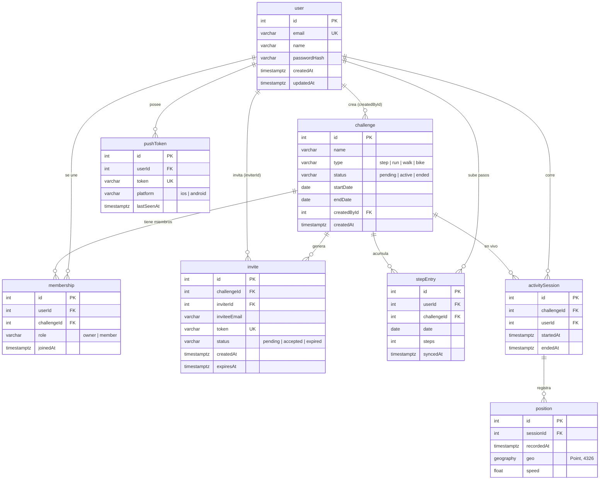

# Diseño de Base de Datos — Fitness MVP

> Motor: PostgreSQL 16 + PostGIS · ORM: TypeORM · Convenciones: **camelCase**, IDs auto-incrementales (`GENERATED ALWAYS AS IDENTITY`), PK/FK explícitas.
> Normalización: **3NF**. Sin atributos multivaluados, sin dependencias parciales ni transitivas.
> Fuente funcional: `openspec/changes/fitness-mvp/design.md` y specs.

---

## Diagrama ER

---

## Tablas en detalle

### `user`
| Columna | Tipo | Restricciones |
|---|---|---|
| id | int | **PK**, auto-incremental |
| email | varchar(255) | **UNIQUE**, NOT NULL |
| name | varchar(80) | NOT NULL |
| passwordHash | varchar(255) | NOT NULL (gestiona better-auth) |
| createdAt / updatedAt | timestamptz | NOT NULL, default now() |

> Nota: better-auth puede crear sus propias tablas de sesión (`session`, `account`). Si las usa, esta tabla es el perfil de dominio y se vincula por `email` o por el id que better-auth exponga. Decisión a confirmar en tarea 2.2.

### `challenge`
| Columna | Tipo | Restricciones |
|---|---|---|
| id | int | **PK**, auto-incremental |
| name | varchar(120) | NOT NULL |
| type | varchar(10) | NOT NULL, CHECK (`step`,`run`,`walk`,`bike`) |
| status | varchar(10) | NOT NULL, default `pending`, CHECK (`pending`,`active`,`ended`) |
| startDate | date | NOT NULL |
| endDate | date | NOT NULL, CHECK (endDate > startDate) |
| createdById | int | **FK → user(id)**, NOT NULL, ON DELETE RESTRICT |
| createdAt | timestamptz | NOT NULL, default now() |

### `membership`
| Columna | Tipo | Restricciones |
|---|---|---|
| id | int | **PK**, auto-incremental |
| userId | int | **FK → user(id)**, NOT NULL, ON DELETE CASCADE |
| challengeId | int | **FK → challenge(id)**, NOT NULL, ON DELETE CASCADE |
| role | varchar(10) | NOT NULL, default `member`, CHECK (`owner`,`member`) |
| joinedAt | timestamptz | NOT NULL, default now() |

- **UNIQUE(userId, challengeId)** — un usuario no entra dos veces al mismo reto.
- La capacidad (≤20) se fuerza a nivel servicio, no en DB (regla de negocio).

### `invite`
| Columna | Tipo | Restricciones |
|---|---|---|
| id | int | **PK**, auto-incremental |
| challengeId | int | **FK → challenge(id)**, NOT NULL, ON DELETE CASCADE |
| inviterId | int | **FK → user(id)**, NOT NULL |
| inviteeEmail | varchar(255) | NULL (NULL = invitación por link/código) |
| token | varchar(64) | **UNIQUE**, NOT NULL |
| status | varchar(10) | NOT NULL, default `pending`, CHECK (`pending`,`accepted`,`expired`) |
| createdAt / expiresAt | timestamptz | NOT NULL |

### `stepEntry`
| Columna | Tipo | Restricciones |
|---|---|---|
| id | int | **PK**, auto-incremental |
| userId | int | **FK → user(id)**, NOT NULL, ON DELETE CASCADE |
| challengeId | int | **FK → challenge(id)**, NOT NULL, ON DELETE CASCADE |
| date | date | NOT NULL |
| steps | int | NOT NULL, CHECK (steps >= 0) |
| syncedAt | timestamptz | NOT NULL, default now() |

- **UNIQUE(userId, challengeId, date)** — base de la sincronización **idempotente** (upsert).

### `activitySession` *(Cut 2)*
| Columna | Tipo | Restricciones |
|---|---|---|
| id | int | **PK**, auto-incremental |
| challengeId | int | **FK → challenge(id)**, NOT NULL, ON DELETE CASCADE |
| userId | int | **FK → user(id)**, NOT NULL, ON DELETE CASCADE |
| startedAt | timestamptz | NOT NULL |
| endedAt | timestamptz | NULL (NULL = sesión en curso) |

### `position` *(Cut 2)*
| Columna | Tipo | Restricciones |
|---|---|---|
| id | int | **PK**, auto-incremental |
| sessionId | int | **FK → activitySession(id)**, NOT NULL, ON DELETE CASCADE |
| recordedAt | timestamptz | NOT NULL |
| geo | geography(Point, 4326) | NOT NULL |
| speed | float | NULL |

- Índice **GiST** sobre `geo` para consultas espaciales.
- Las posiciones en vivo van primero a Redis (hot) y se vuelcan acá al cerrar la sesión (cold).

### `pushToken` *(Cut 3)*
| Columna | Tipo | Restricciones |
|---|---|---|
| id | int | **PK**, auto-incremental |
| userId | int | **FK → user(id)**, NOT NULL, ON DELETE CASCADE |
| token | varchar(255) | **UNIQUE**, NOT NULL |
| platform | varchar(10) | NOT NULL, CHECK (`ios`,`android`) |
| lastSeenAt | timestamptz | NOT NULL, default now() |

---

## Índices

| Tabla | Índice | Por qué |
|---|---|---|
| membership | (challengeId) | listar miembros de un reto |
| membership | (userId) | listar retos de un usuario |
| stepEntry | (challengeId, date) | leaderboard diario (fuente de hidratación de Redis) |
| invite | (token) | join por invitación |
| position | GiST (geo) | distancia real, consultas geo (Cut 2) |
| pushToken | (userId) | dispatch de notificaciones |

## Notas de normalización

- **1NF**: sin listas ni JSON multivaluado en columnas; cada posición es una fila en `position`.
- **2NF**: todas las tablas con clave sustituta simple (`id`); no hay dependencias parciales.
- **3NF**: no hay datos derivables persistidos (el leaderboard se calcula; el rank no se guarda). `invite` no duplica datos del invitado — solo su email o el token.
- Los estados (`type`, `status`, `role`, `platform`) son CHECK constraints con varchar corto: suficiente para el MVP y más simple que tablas catálogo. Si crecen, se promueven a catálogo sin romper nada.
